# ix.br_webscraping_python_zabbix_grafana
Monitorando Status do IX.BR com python e integrando ao Zabbix e Grafana.

#Sumário

Este repositório foi criado com o objetivo de monitorar o status do [IX.br](https://status.ix.br/) com um script Python e integrar a coleta ao Zabbix e Grafana. 

### ix.py

O script acessa a página  [IX.br](https://status.ix.br/), faz web scraping e consolida cada local/serviço com um valor binário (0 = indisponível, 1 = operacional) e envia um JSON para o zabbix coletar via LLD

**exemplo**: python3 ix.py --json — retorna um objeto JSON com pares "Nome": 0|1. 

### Zabbix

Local recomendado do script: */lib/zabbix/externalscripts/python_ix/ix.py* com permissão de execução.

Item mestre: criar ixbr.status.json que executa o script e guarda o JSON. 

LLD (descoberta): regra dependente do item mestre, o JavaScript que converte o JSON em {#IXNAME} para criar itens/trigger dinâmicos. 

Protótipo de item: chave ixbr.status[{#IXNAME}] com JSONPath $.["{#IXNAME}"] para extrair 0/1.

Trigger protótipo: alerta quando o valor é 0.

### Como testar:
**Via agent:**
````
zabbix_get -s 127.0.0.1 -k ixbr.status
````
**Direto no server com saída Json:**
````
/usr/bin/python3 /lib/zabbix/externalscripts/python_ix/ix.py | jq
````

# Dashboard Grafana

Grafana Lab: https://grafana.com/orgs/marcusronney/dashboards

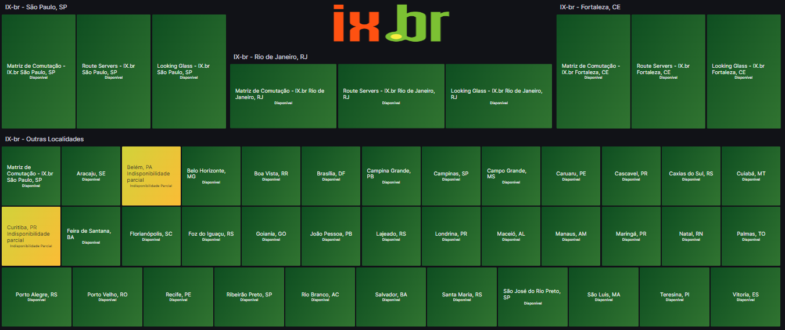


# Deploy

Seguindo as boas práticas do Zabbix, o script será armazenado dentro de */lib/zabbix/externalscripts/*

Permissão de Execução
````
chmod +x /lib/zabbix/externalscripts/python_ix/ix.py
````
**Execute o script manualmente e verifique a saída.**

Saída manual
````
python3 ix.py
````

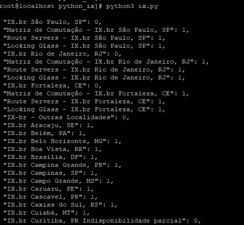


Saída Json
````
python ix.py --json
````

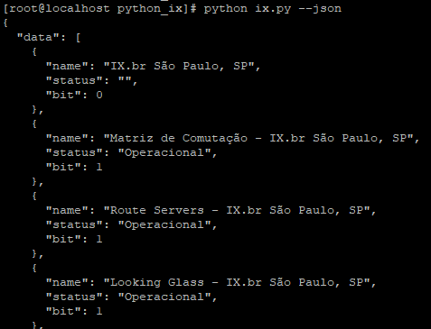


Saída Seletiva
````
python ix.py --name "Rio de Janeiro,"
````

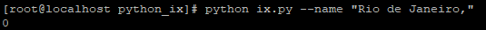

---------------------------------

# Template IX.br Status — Itens, LLD e Tigger

| Nome | Descrição | Key | Tipo | Item Mestre |
|---|---|---|---|---|
| **IX.br status (JSON)** | Item mestre que executa o script Python e retorna o JSON completo | `ixbr.status.json` | Agente Zabbix (ativo) · **Item mestre** | — |
| **IX.br sites** | Regra de descoberta (LLD) que transforma o JSON em lista de `{#IXNAME}` via JavaScript | `ixbr.discovery` | **Regra de descoberta** · Item dependente | IX.br status (JSON) |
| **{#IXNAME}** | Recebe o nome através da macro `{#IXNAME}` e extrai 0/1 via JSONPath `$.["{#IXNAME}"]` | `ixbr.status[{#IXNAME}]` | **Item dependente** (Numérico sem sinal) | IX.br status (JSON) |
| **{#IXNAME} indisponível** | Trigger protótipo: alerta quando o valor do item é 0 (Indisponível) | *(expressão)* `last(/Status IX.BR/ixbr.status[{#IXNAME}])=0` | **Trigger protótipo** | IX.br status (JSON) |
| **Status IX.br** | Mapeamento de valor: `0 → Indisponível`, `1 → Operacional` | — | **Value mapping** | — |


### Item

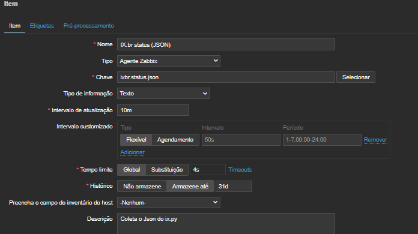

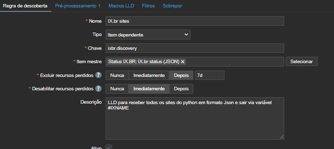

Pré-Processamento JavaScript: Transforma o JSON bruto do item mestre em um array de descobertas.
````
var obj = JSON.parse(value);
var data = [];
for (var k in obj) {
  if (Object.prototype.hasOwnProperty.call(obj, k)) {
    data.push({ "{#IXNAME}": k });
  }
}
return JSON.stringify({ data: data });
````

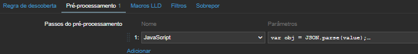

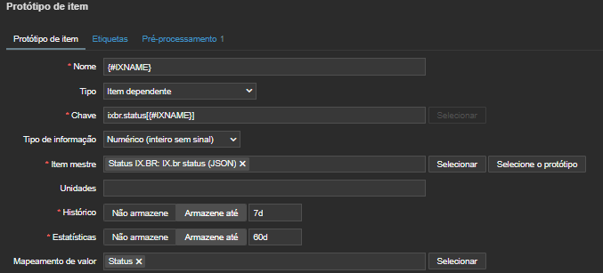

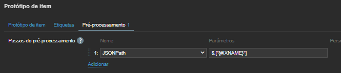

Após a importação do Template no host, realize os testes.

Teste a saída via **zabbix_get** com a váriavel definida no Userparaments.
````
zabbix_get -s 127.0.0.1 -k ixbr.statuss
````

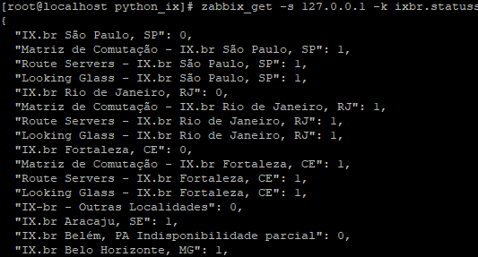

Também podemos rodar diretamente o script no servidor Zabbix.
````
/usr/bin/python3 /lib/zabbix/externalscripts/python_ix/ix.py | jq .
````

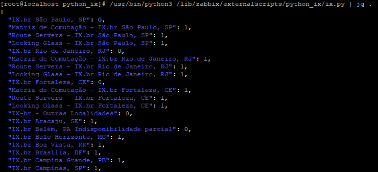

# Host IX.BR

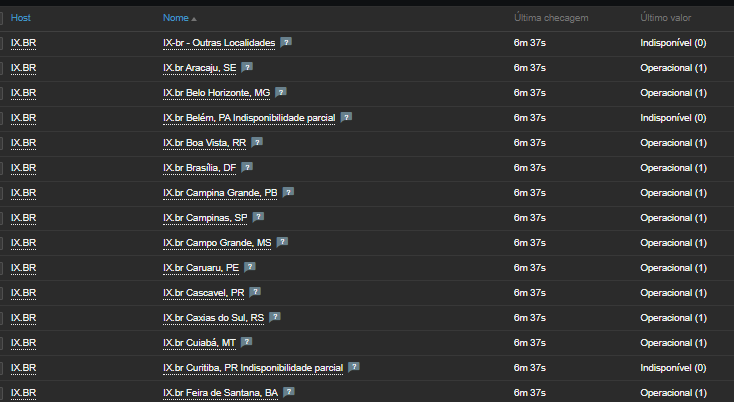
